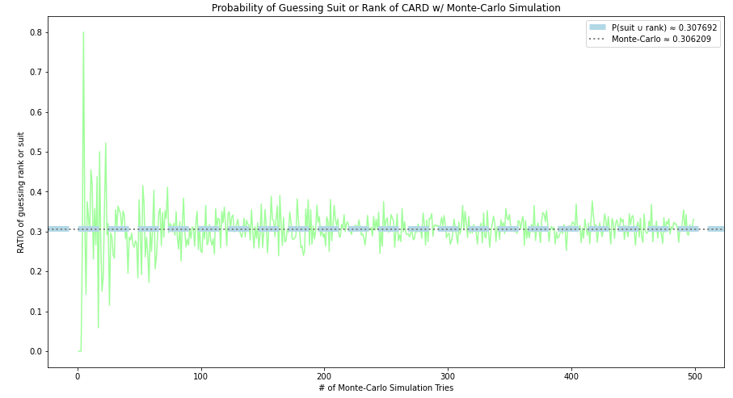
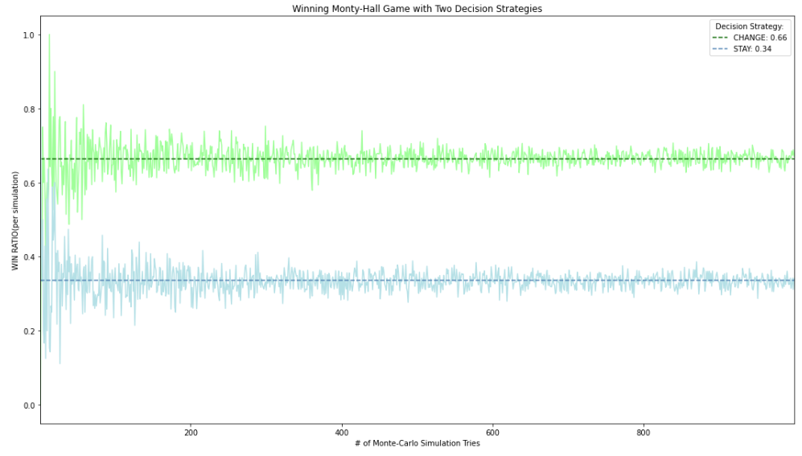
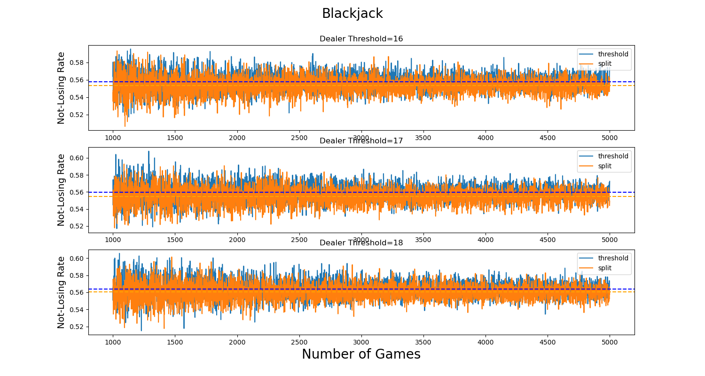

# Monte-Carlo-Simulations

[1. Guess Rank / Suit Problem](#problem1)

[2. Monty Hall Problem](#problem2)

[3. BlackJack Strategy Problem](#problem3)
___
###  <a id="problem1">Guess Rank/Suit Problem:</a>
`1. Guess Rank-or-Suit Problem.ipynb`

* take a DECK (52 cards)
* shuffle it
* put upside down in the center of the table
* person should take one card and guesses RANK or SUIT

___
### <a id="problem2">Monty Hall Problem</a>
`2. Monty Hall Problem.ipynb`

* 3 doors
* 3 prizes(the best one is Car)
* you choose 1 door
* quiz host(knows, where is a prize) opens one door, to show you where is not a car
* you can change a door or stay

___
### <a id="problem3">BlackJack Strategy Problem</a>
`3. BlackJack Strategy Problem.ipynb`

#### STRATEGY#1: 'threshold'
* `STAND(stay with your cards) if your score equals your threshold`
* `HIT(take one card)`
#### STRATEGY#2: 'always split'
* `SPLIT(split hand) always if it's possible`
* `STAND(stay with your cards) if your score equals your threshold`
* `HIT(take one card)`

**dealer always plays with threshold strategy**

